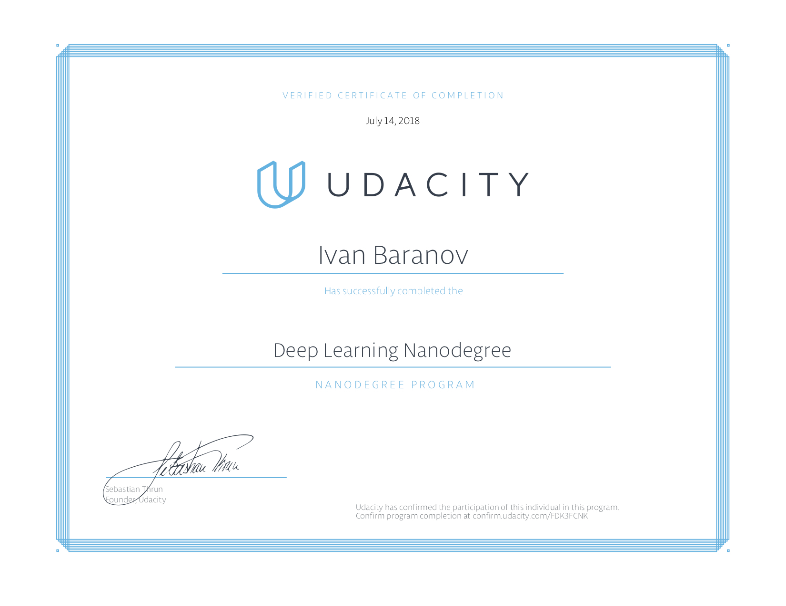

# Deep Learning Nanodegree

This repository contains the projects Udacity Deep Learning Nanogree.

### Project 1: Predicting Bike Sharing Data
*Description*: Fully connected neural network is used to predict future bike-sharing service usage based on past data.

### Project 2: Dog Breed Classifier
*Description*: Convolutional Neural Network (CNN) is used to determine whether an image contains a human, a dog, or neither. If a dog is detected in the image, the program attempts to guess the breed. If a human is detected, the program returns the resembling dog breed.

### Project 3: Generate TV Scripts
*Description*: Recurrent Neural Network (RNN) is used to generate text resembling a TV script based on past episodes of the Simpsons.

### Project 4: Generate Faces
*Description*: Generative Adversarial Network (GAN) is used to generate images resembling human faces based on a dataset of celebrity images.

### Project 5: Teach a Quadcopter to Fly
*Description*: Deep Deterministic Policy Gradient (DDPG) method is used to train a model quadcopter to take off and reach the target altitude.

## Certificate:
